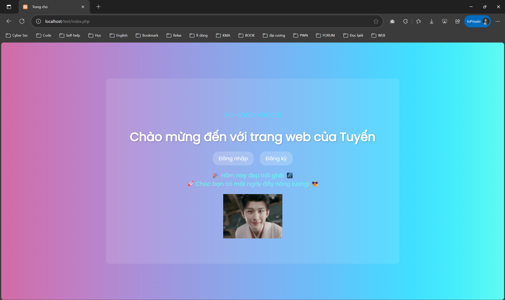

# TASK 1

> Nhiệm vụ của task 1 là:
> 
> - Dev 1 trang web có chức năng cơ bản là đăng ký, đăng nhập, hiển thị thông tin tài khoản (tên, giới tính, email, địa chỉ, sdt), search người dùng
> - Phần client thì không cần quá đẹp
> - Phần server thì chọn ngôn ngữ PHP và database MySQL

## I. Demo web

1. Trang chủ



1. Trang đăng ký


1. Trang đăng nhập


1. Màn hình sau khi đăng nhập


1. Chức năng tìm kiếm


1. Chức năng xem thông tin cá nhân


1. Cơ sở dữ liệu


## II. Quy trình tạo trang web

- Để tạo trang web đáp ứng được yêu cầu, mình đã chia làm các bước như sau:
🔹 Bước 1: Tạo database và bảng `users` trong XAMPP để làm cơ sở dữ liệu lưu thông tin người dùng. CSDL này bao gồm các trường id (khóa chính, tự động tăng), username, password, name, gender, email, address, phone
🔹 Bước 2: Tạo file trang chủ `index.php` và file `db.php` để kết nối database
🔹 Bước 3: Tạo giao diện form đăng ký (`register.php`) với form HTML để người dùng nhập thông tin
🔹 Bước 4: Tạo trang xử lý đăng ký (`register_file.php`) để nhận dữ liệu từ form đăng ký. Trang này sử dụng PHP để kiểm tra dữ liệu (ví dụ: email hợp lệ, username không trùng), lưu thông tin vào bảng users bằng truy vấn SQL INSERT, chuyển hướng người dùng về trang đăng nhập sau khi đăng ký thành công
🔹 Bước 5: Tạo form đăng nhập (`login.php`) với form HTML để người dùng nhập username và password
🔹 Bước 6: Xử lý đăng nhập (`login_file.php`). Trang này nhận dữ liệu từ form đăng nhập, truy vấn database để kiểm tra username và xác minh mật khẩu, tạo session cho người dùng nếu đăng nhập thành công và chuyển hướng đến trang profile.php
🔹 Bước 7: Hiển thị thông tin người dùng (`profile.php`) để hiển thị thông tin tài khoản (tên, giới tính, email, địa chỉ, số điện thoại) từ session hiện tại. Sử dụng truy vấn SQL SELECT để lấy dữ liệu từ bảng users dựa trên username
🔹 Bước 8: Search người dùng qua username (`search.php`) với form tìm kiếm bằng username. Khi người dùng nhập username và gửi, file này sẽ sử dụng truy vấn SQL SELECT để tìm kiếm người dùng trong bảng users, hiển thị thông tin (tên, email, v.v.) của người dùng khớp với username được nhập
🔹 Bước 8: Chức năng logout (`logout.php`) để hủy session hiện tại bằng session_destroy(), chuyển hướng người dùng về trang chủ
- Cấu trúc thư mục:

```python
web/
├── index.html        ← Trang chính hoặc chuyển hướng
├── register.php      ← Form đăng ký
├── register_file.php ← Xử lý đăng ký
├── login.php         ← Form đăng nhập
├── login_file.php    ← Xử lý đăng nhập
├── profile.php       ← Hiển thị thông tin người dùng
├── db.php            ← Kết nối MySQL
├── search.php        ← Chức năng search
└── logout.php        ← Chức năng logout
```

- Phân biệt client và server:
+ Client: Là phần giao diện người dùng (frontend), nơi người dùng tương tác trực tiếp với trang web (ví dụ: nhập thông tin, nhấn nút). Thường được viết bằng HTML, CSS, JavaScript và không xử lý logic phức tạp hay lưu trữ dữ liệu
+ Server: Là phần backend, chịu trách nhiệm xử lý logic, lưu trữ và quản lý dữ liệu (ví dụ: xử lý đăng ký, kết nối với database). Thường sử dụng các ngôn ngữ như PHP và cơ sở dữ liệu như MySQL
- So sánh HTML và PHP:
+ HTML: Dùng để hiển thị nội dung, tạo giao diện người dùng
+ PHP: Dùng để xử lý dữ liệu, logic phía máy chủ, thường được nhúng vào HTML để tạo ra trang web động

## III.  Source code

- a) `index.php`
    
    ```python
    <?php
    session_start();
    #Dùng để lưu phiên đăng nhập cho các trang
    ?>
    
    <!DOCTYPE html>
    <html>
    <head>
      <title>Trang chủ</title>
      <style>
                        @font-face {
                font-family: 'NeueMachina';
                src: url('fonts/NeueMachina-Light.otf') format('opentype');
                font-weight: 500;
                font-style: normal;
            }
    
            @font-face {
                font-family: 'Poppins';
                src: url('fonts/Poppins-Regular.ttf') format('opentype');
                font-weight: 300;
                font-style: normal;
            }
    
            * {
                box-sizing: border-box;
                font-family: 'Poppins', sans-serif;
            }
        body {
          background: linear-gradient(to right, #d16ba5, #c777b9, #ba83ca, #aa8fd8, #9a9ae1, #8aa7ea, #79b3f4, #69bff8, #52cffe, #41dfff, #46eefa, #5ffbf1);
          margin: 0;
          padding: 0;
          font-family: Arial, sans-serif;
          display: flex;
          justify-content: center;
          align-items: center;
          min-height: 100vh;
          color: #fff;
        }
        .container {
          text-align: center;
          padding: 80px;
          background: rgba(255, 255, 255, 0.1);
          border-radius: 10px;
        }
        h1 {
          font-size: 2.5em;
          margin-bottom: 10px;
          text-shadow: 2px 2px 4px rgba(0, 0, 0, 0.2);
        }
        .greeting {
          font-size: 1.5em;
          margin-bottom: 20px;
          color: #41dfff;
        }
        .nav {
          margin: 20px 0;
          display: flex;
          justify-content: center;
          gap: 20px;
        }
        .nav a {
          color: #fff;
          text-decoration: none;
          padding: 10px 20px;
          background: rgba(255, 255, 255, 0.2);
          border-radius: 20px;
          font-size: 1.1em;
          transition: all 0.3s ease;
        }
        .nav a:hover {
          background: #41dfff;
          color: #fff;
          text-decoration: none;
          transform: scale(1.1);
        }
        .fun-section {
          margin-top: 20px;
          font-size: 1.2em;
          color: #5ffbf1;
        }
        .fun-image {
          margin-top: 20px;
          max-width: 200px;
        }
      </style>
    </head>
    <body>
      <div class="container">
        <?php if (isset($_SESSION["user"])): ?>
          <p class="greeting">Xin chào <?php echo $_SESSION["user"]["name"]; ?>!</p>
          <h1>Chào mừng đến với trang web của Tuyến</h1>
          <div class="nav">
            <a href="search.php">Tìm kiếm</a>
            <a href="profile.php">Xem thông tin cá nhân</a>
            <a href="logout.php">Đăng xuất</a>
          </div>
        <?php else: ?>
          <p class="greeting">Xin chào Khách!</p>
          <h1>Chào mừng đến với trang web của Tuyến</h1>
          <div class="nav">
            <a href="login.php">Đăng nhập</a>
            <a href="register.php">Đăng ký</a>
          </div>
        <?php endif; ?>
    
        <div class="fun-section">
          🎉 Hôm nay đẹp trời ghê! 🌌<br>
          🚀 Chúc bạn có một ngày đầy năng lượng! 😎
        </div>
        
    </iframe>
      </div>
    </body>
    </html>
    ```
    
    - Chức năng chính:
    + Khởi tạo phiên đăng nhập bằng session_start() để lưu trữ thông tin người dùng
    + Hiển thị lời chào tùy thuộc vào trạng thái đăng nhập: "Xin chào [Tên người dùng]" nếu đã đăng nhập, hoặc "Xin chào Khách" nếu chưa
    + Cung cấp các chức năng tùy thuộc vào trạng thái đăng nhập: Nếu đã đăng nhập thì có 3 chức năng: "Tìm kiếm", "Xem thông tin cá nhân", "Đăng xuất". Nếu chưa đăng nhập thì chỉ có 2 chức năng: "Đăng nhập", "Đăng ký"
    - Ngôn ngữ: PHP, HTML, CSS (phần này mình dùng AI hết ;v)
- b) `db.php`
    
    ```python
    <?php
    $conn = new mysqli("localhost", "root", "", "test");
    
    if ($conn->connect_error) {
        die("Kết nối thất bại: " . $conn->connect_error);
    }
    
    //charset UTF-8mb4 để hỗ trợ đầy đủ tiếng Việt
    $conn->set_charset("utf8mb4");
    
    ?>
    ```
    
    - File `db.php` chịu trách nhiệm thiết lập kết nối giữa ứng dụng PHP và cơ sở dữ liệu MySQL.
    - Chức năng chính:
    + Tạo kết nối tới cơ sở dữ liệu trên localhost sử dụng XAMPP
    + Xử lý lỗi kết nối nếu có.
    + Thiết lập bộ mã hóa ký tự UTF-8mb4 để hỗ trợ đầy đủ tiếng Việt
    - Ngôn ngữ: PHP
    
- c) `register.php`
    
    ```python
    <?php
    include "db.php";
    $name = $password = $email = $phone = $gender = $address = "";
    
    if (isset($_GET['error'])) {
        echo "<script>alert('" . htmlspecialchars($_GET['error']) . "');</script>";
    }
    ?>
    <!DOCTYPE html>
    <html lang="vi">
    <head>
        <meta charset="UTF-8">
        <title>Đăng ký</title>
        <style>
            @font-face {
                font-family: 'NeueMachina';
                src: url('fonts/NeueMachina-Light.otf') format('opentype');
                font-weight: 500;
                font-style: normal;
            }
    
            @font-face {
                font-family: 'Poppins';
                src: url('fonts/Poppins-Regular.ttf') format('opentype');
                font-weight: 300;
                font-style: normal;
            }
    
            * {
                box-sizing: border-box;
                font-family: 'Poppins', sans-serif;
            }
    
            body {
                margin: 0;
                min-height: 90vh;
                padding: 20px;
                background: url('images/background-2.jpg') center/cover no-repeat;
                display: flex;
                justify-content: center;
                align-items: center;
                position: relative; /* thêm để định vị nút Home */
            }
    
            form {
                background: rgba(255,255,255,0.01);
                backdrop-filter: blur(0.1px);
                border: 1px solid rgba(255,255,255,0.35);
                border-radius: 45px;
                padding: 40px;
                max-width: 600px;
                width: 100%;
                color: #000;
                box-shadow: 0 10px 40px rgba(0,0,0,0.25);
            }
    
            h1 {
                text-align: center;
                margin-bottom: 25px;
                color: #333;
                font-size: 2.1rem;
                font-weight: 600;
            }
    
            .row-input {
                display: flex;
                gap: 20px;
                margin-bottom: 20px;
                flex-wrap: wrap;
            }
    
            .row-input > div {
                flex: 1;
                display: flex;
                flex-direction: column;
            }
    
            label {
                margin-bottom: 6px;
                font-weight: 500;
            }
    
            input[type="text"],
            input[type="email"],
            input[type="password"],
            .row-input select {
                width: 100%;
                padding: 10px;
                border: 1px solid #fff;
                border-radius: 50px;
                box-sizing: border-box;
                font-size: 14px;
                background-color: #fff;
                color: #666;
                appearance: none;
            }
    
            .row-input select {
                background: url('data:image/svg+xml;utf8,<svg xmlns="http://www.w3.org/2000/svg" width="10" height="5" viewBox="0 0 10 5"><path d="M0 0h10L5 5z" fill="black"/></svg>') no-repeat right 10px center;
                background-size: 10px;
                background-color: #fff;
            }
    
            input[type="text"]:focus,
            input[type="email"]:focus,
            input[type="password"]:focus,
            select:focus {
                border-color: #ff69b4;
                outline: none;
            }
    
            input[type="submit"] {
                background: #000;
                color: #fff;
                border: none;
                padding: 6px 30px;
                font-size: 16px;
                border-radius: 25px;
                cursor: pointer;
                display: block;
                margin: 0 auto;
                transition: background 0.3s ease, transform 0.2s ease;
            }
    
            .or-back {
                display: block;
                text-align: center;
                margin-top: 10px;
                font-size: 14px;
                color: #000;
                text-decoration: none;
                transition: color 0.3s ease;
            }
    
            .or-back:hover {
                color: #555;
            }
    
            input[type="submit"]:hover {
                background: #333;
                transform: scale(1.05);
            }
    
            /* thêm nút Home góc trái */
            .home-link {
                position: absolute;
                top: 20px;
                left: 20px;
                font-size: 14px;
                text-decoration: none;
                color: #000;
                background: rgba(255,255,255,0.7);
                padding: 5px 10px;
                border-radius: 50px;
                transition: background 0.3s ease;
            }
    
            .home-link:hover {
                background: rgba(255,255,255,1);
            }
    
            @media (max-width: 600px) {
                .row-input {
                    flex-direction: column;
                }
            }
        </style>
    </head>
    <body>
    
    <!-- nút Home góc trái -->
    <a href="index.php" class="home-link">🏠 Home</a>
    
    <script>
    function togglePassword() {
        const passwordInput = document.getElementById("password");
        const button = event.target;
    
        if (passwordInput.type === "password") {
            passwordInput.type = "text";
            button.textContent = "Hide";
        } else {
            passwordInput.type = "password";
            button.textContent = "Show";
        }
    }
    </script>
    
    <form method="post" action="register_file.php">
        <h1 class="signup-text">Sign up</h1>
    
        <div class="row-input">
            <div>
                <label for="name">Username:</label>
                <input type="text" id="name" name="name" value="<?= $name ?>">
            </div>
            <div>
                <label for="password">Password:</label>
                <div style="position: relative;">
                    <input type="password" id="password" name="password" value="<?= $password ?>" style="padding-right: 70px;">
                    <button type="button" onclick="togglePassword()" style="
                        position: absolute;
                        right: 10px;
                        top: 50%;
                        transform: translateY(-50%);
                        padding: 5px 10px;
                        border: none;
                        background: #f5e4e9;
                        border-radius: 15px;
                        cursor: pointer;
                    ">Show</button>
                </div>
            </div>
        </div>
    
        <div class="row-input">
            <div>
                <label for="email">E-mail:</label>
                <input type="text" id="email" name="email" value="<?= $email ?>">
            </div>
            <div>
                <label for="phone">Phone number:</label>
                <input type="text" id="phone" name="phone" value="<?= $phone ?>">
            </div>
        </div>
    
        <div class="row-input">
            <div>
                <label for="address">Address:</label>
                <input type="text" id="address" name="address" value="<?= $address ?>">
            </div>
        </div>
    
        <div class="row-input">
            <div>
                <label for="gender">Gender:</label>
                <select id="gender" name="gender">
                    <option value="Female" <?= ($gender == "Female") ? "selected" : "" ?>>Female</option>
                    <option value="Male" <?= ($gender == "Male") ? "selected" : "" ?>>Male</option>
                    <option value="Other" <?= ($gender == "Other") ? "selected" : "" ?>>Other</option>
                </select>
            </div>
        </div>
    
        <input type="submit" name="submit" value="Sign up">
        <a href="login.php" class="or-back">or Login</a>
    </form>
    
    </body>
    </html>
    ```
    
    - File `register.php` cung cấp giao diện để người dùng đăng ký tài khoản với các thông tin cơ bản
    - Chức năng chính:
    + Kết nối với file db.php để sử dụng cơ sở dữ liệu.
    + Hiển thị form đăng ký với các trường: username, password, email, phone, address, và gender.
    + Hiển thị thông báo lỗi (nếu có) qua thông số $_GET['error'].
    + Cho phép người dùng chuyển hướng đến trang đăng nhập hoặc quay về trang chủ
    - Ngôn ngữ:
    + PHP: Kết nối database và xử lý dữ liệu đầu vào.
    + HTML/CSS: Thiết kế form với giao diện đẹp, sử dụng font tùy chỉnh
    + JavaScript: Thêm chức năng toggle để ẩn hoặc hiện mật khẩu
- d) `register_file.php`
    
    ```python
    <?php
    include "db.php";
    
    $name = $_POST['name'];
    $password = $_POST['password'];
    $email = $_POST['email'];
    $phone = $_POST['phone'];
    $gender = $_POST['gender'] ?? '';
    $address = $_POST['address'];
    
    // Kiểm tra dữ liệu rỗng
    if (empty($name) || empty($password) || empty($email) || empty($phone) || empty($gender) || empty($address)) {
        header("Location: register.php?error=Vui+lòng+điền+đầy+đủ+thông+tin");
        exit();
    }
    
    // Kiểm tra email hợp lệ
    if (!filter_var($email, FILTER_VALIDATE_EMAIL)) {
        header("Location: register.php?error=Email+không+hợp+lệ");
        exit();
    }
    
    // Kiểm tra số điện thoại hợp lệ
    if (!preg_match("/^[0-9]{10,15}$/", $phone)) {
        header("Location: register.php?error=Số+điện+thoại+không+hợp+lệ");
        exit();
    }
    
    // Kiểm tra độ dài mật khẩu
    if (strlen($password) < 6) {
        header("Location: register.php?error=Mật+khẩu+phải+có+ít+nhất+6+ký+tự");
        exit();
    }
    
    // Kiểm tra trùng email
    $check_email = "SELECT * FROM users WHERE email = '$email'";
    $result = $conn->query($check_email);
    if ($result->num_rows > 0) {
        header("Location: register.php?error=Email+đã+được+sử+dụng");
        exit();
    }
    
    // INSERT dữ liệu
    $sql = "INSERT INTO users (name, gender, email, address, phone, password) 
            VALUES ('$name', '$gender', '$email', '$address', '$phone', '$password')";
    
    if ($conn->query($sql) === TRUE) {
        echo "<script>
            alert('Đăng ký thành công!');
            window.location.href = 'index.php';
        </script>";
    } else {
        $error_msg = addslashes($conn->error);
        echo "<script>
            alert('Lỗi đăng ký: $error_msg');
            window.location.href = 'index.php';
        </script>";
    }
    ?>
    ```
    
    - File `register_file.php` xử lý dữ liệu đăng ký từ form trong register.php và lưu thông tin vào cơ sở dữ liệu
    - Chức năng chính:
    + Nhận dữ liệu từ form đăng ký (username, password, email, phone, gender, address).
    + Kiểm tra tính hợp lệ của dữ liệu (rỗng, email, số điện thoại, độ dài mật khẩu, trùng email).
    + Lưu thông tin người dùng vào bảng users trong database.
    + Chuyển hướng và thông báo kết quả (thành công hoặc lỗi).
    - Ngôn ngữ:
    + PHP: Xử lý dữ liệu, kiểm tra tính hợp lệ và tương tác với database.
    + MySQL: Lưu trữ dữ liệu người dùng trong bảng users
- e) `login.php`
    
    ```python
    <!DOCTYPE html>
    <html lang="vi">
    <head>
        <meta charset="UTF-8">
        <title>Đăng nhập</title>
        <style>
            @font-face {
                font-family: 'NeueMachina';
                src: url('fonts/NeueMachina-Light.otf') format('opentype');
                font-weight: 500;
                font-style: normal;
            }
    
            @font-face {
                font-family: 'Poppins';
                src: url('fonts/Poppins-Regular.ttf') format('opentype');
                font-weight: 300;
                font-style: normal;
            }
    
            * {
                box-sizing: border-box;
                font-family: 'Poppins', sans-serif;
            }
    
            body {
                margin: 0;
                min-height: 90vh;
                padding: 20px;
                background: url('images/background-2.jpg') center/cover no-repeat;
                display: flex;
                justify-content: center;
                align-items: center;
                position: relative;
            }
    
            form {
                background: rgba(255,255,255,0.01);
                backdrop-filter: blur(0.1px);
                border: 1px solid rgba(255,255,255,0.35);
                border-radius: 45px;
                padding: 40px;
                max-width: 600px;
                width: 100%;
                color: #000;
                box-shadow: 0 10px 40px rgba(0,0,0,0.25);
            }
    
            h1 {
                text-align: center;
                margin-bottom: 25px;
                color: #333;
                font-size: 2.1rem;
                font-weight: 600;
            }
    
            .row-input {
                display: flex;
                flex-direction: column;
                gap: 20px;
                margin-bottom: 20px;
            }
    
            .row-input > div {
                display: flex;
                flex-direction: column;
            }
    
            label {
                margin-bottom: 6px;
                font-weight: 500;
            }
    
            input[type="email"],
            input[type="password"] {
                width: 100%;
                padding: 10px;
                border: 1px solid #fff;
                border-radius: 50px;
                box-sizing: border-box;
                font-size: 14px;
                background-color: #fff;
                color: #666;
            }
    
            input[type="email"]:focus,
            input[type="password"]:focus {
                border-color: #ff69b4;
                outline: none;
            }
    
            button[type="submit"] {
                background: #000;
                color: #fff;
                border: none;
                padding: 6px 30px;
                font-size: 16px;
                border-radius: 25px;
                cursor: pointer;
                display: block;
                margin: 0 auto;
                transition: background 0.3s ease, transform 0.2s ease;
            }
    
            button[type="submit"]:hover {
                background: #333;
                transform: scale(1.05);
            }
    
            .or-back {
                display: block;
                text-align: center;
                margin-top: 10px;
                font-size: 14px;
                color: #000;
                text-decoration: none;
                transition: color 0.3s ease;
            }
    
            .or-back:hover {
                color: #555;
            }
    
            .home-link {
                position: absolute;
                top: 20px;
                left: 20px;
                font-size: 14px;
                text-decoration: none;
                color: #000;
                background: rgba(255,255,255,0.7);
                padding: 5px 10px;
                border-radius: 50px;
                transition: background 0.3s ease;
            }
    
            .home-link:hover {
                background: rgba(255,255,255,1);
            }
    
            .error {
                color: #FF0000;
                text-align: center;
                margin-bottom: 20px;
            }
    
            @media (max-width: 600px) {
                .row-input {
                    flex-direction: column;
                }
            }
        </style>
    </head>
    <body>
        <!-- Nút Home góc trái -->
        <a href="index.php" class="home-link">🏠 Home</a>
    
        <form action="login_file.php" method="POST">
            <h1>Login</h1>
            <div class="row-input">
                <div>
                    <label for="email">E-mail:</label>
                    <input type="email" id="email" name="email">
                </div>
                <div>
                    <label for="password">Password:</label>
                    <input type="password" id="password" name="password">
                </div>
            </div>
            <button type="submit">Login</button>
            <a href="register.php" class="or-back">or Sign up</a>
        </form>
    </body>
    </html>
    ```
    
    - File `login.php` cung cấp giao diện để người dùng đăng nhập vào hệ thống với email và mật khẩu
    - Chức năng chính:
    + Hiển thị form đăng nhập với các trường: email và password.
    + Cho phép người dùng chuyển hướng đến trang đăng ký hoặc quay về trang chủ.
    - Ngôn ngữ:HTML/CSS: thiết kế giao diện form với font tùy chỉnh (NeueMachina, Poppins), hiệu ứng gradient nền từ hình ảnh
- f) `login_file.php`
    
    ```python
    <?php
    session_start();
    include "db.php";
    
    $email = $_POST["email"];
    $password = $_POST["password"];
    
    $sql = "SELECT * FROM users WHERE email='$email'";
    $result = $conn->query($sql);
    
    if ($result->num_rows == 1) {
        $row = $result->fetch_assoc();
        if ($password === $row["password"]) {
            $_SESSION["user"] = $row;
            header("Location: index.php");
        } else {
            echo "Sai mật khẩu";
        }
    } else {
        echo "Không tìm thấy tài khoản";
    }
    ?>
    ```
    
    - File `login_file.php` xử lý dữ liệu đăng nhập từ form trong login.php và xác thực thông tin người dùng.
    - Chức năng chính:
    + Nhận dữ liệu email và mật khẩu từ form đăng nhập.
    + Xác thực thông tin đăng nhập bằng cách kiểm tra trong cơ sở dữ liệu.
    + Tạo session cho người dùng nếu đăng nhập thành công và chuyển hướng về trang chủ.
    + Thông báo lỗi nếu đăng nhập thất bại (email không tồn tại hoặc sai mật khẩu).
    - Ngôn ngữ:
    + PHP: Xử lý logic đăng nhập, quản lý session và truy vấn database.
    + MySQL: Truy vấn bảng users để xác thực thông tin đăng nhập.
- g) `profile.php`
    
    ```python
    <?php
    session_start();
    if (!isset($_SESSION["user"])) {
        header("Location: login.php");
        exit();
    }
    
    $user = $_SESSION["user"];
    ?>
    
    <!DOCTYPE html>
    <html lang="vi">
    <head>
        <meta charset="UTF-8">
        <title>Thông tin người dùng</title>
        <style>
            @import url('https://fonts.googleapis.com/css2?family=Quicksand:wght@400;600&display=swap');
    
            body {
                margin: 0;
                padding: 50px 20px;
                font-family: 'Quicksand', sans-serif;
                background-image: linear-gradient(135deg, #D16BA5, #86ABE7, #5FFBF1);
                color: #fff;
                display: flex;
                flex-direction: column;
                align-items: center;
                min-height: 100vh;
            }
    
            a button {
                position: fixed;
                top: 20px;
                left: 20px;
                background-color: #5FFBF1;
                color: #333;
                border: none;
                padding: 10px 20px;
                font-size: 16px;
                border-radius: 25px;
                cursor: pointer;
                box-shadow: 0 4px 10px rgba(0,0,0,0.2);
                transition: transform 0.2s, background-color 0.3s;
            }
    
            a button:hover {
                background-color: #D16BA5;
                color: #fff;
                transform: scale(1.1);
            }
    
            h1 {
                font-size: 36px;
                margin-bottom: 30px;
                text-shadow: 0 2px 6px rgba(0,0,0,0.3);
            }
    
            .info-box {
                background: rgba(255, 255, 255, 0.2);
                padding: 30px 40px;
                border-radius: 20px;
                box-shadow: 0 8px 25px rgba(0,0,0,0.3);
                width: 80%;
                max-width: 500px;
                backdrop-filter: blur(10px);
            }
    
            .info-box p {
                margin: 10px 0;
                font-size: 18px;
                background: rgba(255, 255, 255, 0.15);
                padding: 10px 15px;
                border-radius: 15px;
                box-shadow: inset 0 2px 5px rgba(0,0,0,0.1);
                color: #fff;
            }
    
            .info-label {
                font-weight: 600;
                color: #D16BA5;
            }
    
            .info-value {
                color: #5FFBF1;
            }
        </style>
    </head>
    <body>
    
    <a href="index.php"><button>🏠 Home</button></a>
    
    <h1>✨ Thông tin của bạn ✨</h1>
    
    <div class="info-box">
        <p><span class="info-label">Tên:</span> <span class="info-value"><?php echo $user["name"]; ?></span></p>
        <p><span class="info-label">Giới tính:</span> <span class="info-value"><?php echo $user["gender"]; ?></span></p>
        <p><span class="info-label">Email:</span> <span class="info-value"><?php echo $user["email"]; ?></span></p>
        <p><span class="info-label">Địa chỉ:</span> <span class="info-value"><?php echo $user["address"]; ?></span></p>
        <p><span class="info-label">SĐT:</span> <span class="info-value"><?php echo $user["phone"]; ?></span></p>
    </div>
    
    </body>
    </html>
    
    ```
    
    - File `profile.php` hiển thị thông tin cá nhân của người dùng đã đăng nhập.
    - Chức năng chính:
    + Kiểm tra trạng thái đăng nhập và chuyển hướng về trang login.php nếu chưa đăng nhập.
    + Hiển thị thông tin tài khoản (tên, giới tính, email, địa chỉ, số điện thoại) từ session.
    + Có nút quay về trang chủ.
    - Ngôn ngữ:
    + PHP: Quản lý session và hiển thị dữ liệu động.
    + HTML/CSS: Thiết kế giao diện với font Quicksand, gradient nền, và hiệu ứng shadow.
- h) `search.php`
    
    ```python
    <?php
    session_start();
    require 'db.php'; 
    if (!isset($_SESSION["user"])) {
        header("Location: login.php");
        exit();
    }
    ?>
    
    <!DOCTYPE html>
    <html lang="vi">
    <head>
        <meta charset="UTF-8">
        <title>Search Page</title>
        <style>
                    @font-face {
                font-family: 'NeueMachina';
                src: url('fonts/NeueMachina-Light.otf') format('opentype');
                font-weight: 500;
                font-style: normal;
            }
    
            @font-face {
                font-family: 'Poppins';
                src: url('fonts/Poppins-Regular.ttf') format('opentype');
                font-weight: 300;
                font-style: normal;
            }
    
            * {
                box-sizing: border-box;
                font-family: 'Poppins', sans-serif;
            }
    
            body {
                margin: 0;
                font-family: 'Quicksand', sans-serif;
                background-image: linear-gradient(to right top, #d16ba5, #86abe7, #5ffbf1);
                color: #fff;
                display: flex;
                flex-direction: column;
                align-items: center;
                justify-content: flex-start;
                min-height: 100vh;
                padding: 50px 20px;
            }
    
            a button {
                position: fixed;
                top: 20px;
                left: 20px;
                background-color: #5ffbf1;
                color: #333;
                border: none;
                padding: 10px 20px;
                font-size: 16px;
                border-radius: 25px;
                cursor: pointer;
                box-shadow: 0 4px 10px rgba(0,0,0,0.2);
                transition: transform 0.2s, background-color 0.3s;
            }
    
            a button:hover {
                background-color: #86abe7;
                transform: scale(1.05);
            }
    
            h1 {
                font-size: 36px;
                margin-bottom: 30px;
                text-shadow: 0 2px 4px rgba(0,0,0,0.2);
            }
    
            form {
                background: rgba(255,255,255,0.15);
                padding: 20px 30px;
                border-radius: 20px;
                box-shadow: 0 8px 20px rgba(0,0,0,0.2);
                margin-bottom: 30px;
                display: flex;
                flex-wrap: wrap;
                gap: 10px;
            }
    
            input {
                padding: 10px;
                border: none;
                border-radius: 20px;
                width: 200px;
                outline: none;
                font-size: 16px;
            }
    
            button[type="submit"] {
                background-color: #5ffbf1;
                border: none;
                padding: 10px 20px;
                border-radius: 25px;
                font-size: 16px;
                cursor: pointer;
                box-shadow: 0 4px 10px rgba(0,0,0,0.2);
                transition: transform 0.2s, background-color 0.3s;
            }
    
            button[type="submit"]:hover {
                background-color: #86abe7;
                transform: scale(1.05);
                color: #fff;
            }
    
            .result {
                background: rgba(255,255,255,0.15);
                padding: 15px 20px;
                border-radius: 15px;
                width: 80%;
                box-shadow: 0 4px 15px rgba(0,0,0,0.2);
                margin-bottom: 15px;
                text-align: left;
            }
    
            .result p {
                margin: 5px 0;
            }
        </style>
    </head>
    <body>
    
    <a href="index.php"><button>🏠 Home</button></a>
    
    <h1>🔍 Tìm kiếm người dùng</h1>
    
    <form method="GET">
        <input name="name" placeholder="Nhập tên cần tìm">
        <button type="submit">Tìm kiếm</button>
    </form>
    
    <?php
    if (isset($_GET['name'])) {
        $search = $_GET['name'];
        $search = "%$search%";
    
        $stmt = $conn->prepare("SELECT id, name, gender, email, address, phone FROM users WHERE name LIKE ?");
        $stmt->bind_param("s", $search);
        $stmt->execute();
        $result = $stmt->get_result();
    
        if ($result->num_rows > 0) {
            while ($user = $result->fetch_assoc()) {
                echo "<div class='result'>";
                echo "<p><strong>ID:</strong> {$user['id']}</p>";
                echo "<p><strong>Tên:</strong> {$user['name']}</p>";
                echo "<p><strong>Giới tính:</strong> {$user['gender']}</p>";
                echo "<p><strong>Email:</strong> {$user['email']}</p>";
                echo "<p><strong>Địa chỉ:</strong> {$user['address']}</p>";
                echo "<p><strong>SĐT:</strong> {$user['phone']}</p>";
                echo "</div>";
            }
        } else {
            echo "<p>😥 Không tìm thấy người dùng nào.</p>";
        }
    
        $stmt->close();
    }
    ?>
    
    </body>
    </html>
    
    ```
    
    - File `search.php` cho phép người dùng tìm kiếm thông tin người dùng khác dựa trên username
    - Chức năng chính:
    + Kiểm tra trạng thái đăng nhập, chuyển hướng về login.php nếu chưa đăng nhập.
    + Hiển thị form tìm kiếm để nhập tên người dùng cần tìm.
    + Tìm kiếm và hiển thị thông tin người dùng (ID, tên, giới tính, email, địa chỉ, số điện thoại) từ database.
    + Nút quay về trang chủ.
    - Ngôn ngữ:
    _ PHP: Quản lý session, truy vấn database, và xử lý tìm kiếm.
    + HTML/CSS: Thiết kế giao diện với font Poppins, gradient nền, và hiệu ứng shadow.
    + MySQL: Truy vấn bảng users để tìm kiếm người dùng.
- i) `logout.php`
    
    ```python
    <?php
        session_start();
        session_destroy();
        header('location:index.php');
    ?>
    ```
    
    - File `logout.php` xử lý việc đăng xuất người dùng khỏi hệ thống.
    - Chức năng chính:
    + Hủy toàn bộ session của người dùng hiện tại.
    + Chuyển hướng người dùng về trang chủ (index.php) sau khi đăng xuất.
    - Ngôn ngữ: PHP

## IV. Hạn chế

- Trang web này mình không dùng mã hóa mật khẩu nên dễ bị hack =))
- Chắc chắn còn nhiều lỗ hổng lắm nhưng mà mình chưa học lỗ hổng nào nên chưa nhìn ra :v
- Phần CSS chủ yếu mình dùng AI code